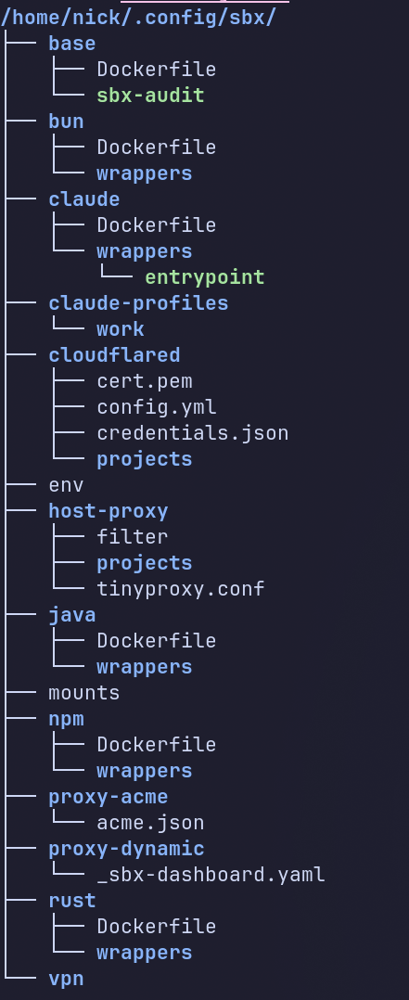

# sbx

Sandboxed Docker dev environments. Pick a flavor (npm, bun, rust, java,
claude, ...), `sbx init` a project, then `sbx shell` (or `sbx run`) to drop
into a container with your repo bind-mounted at the same path it lives at
on the host. Single Rust binary; dynamic shell completions via
`clap_complete`.


## Why

Modern dev environments are full of code you didn't write and don't audit:
transitive npm/pip/cargo dependencies, postinstall scripts, AI coding agents
running shell commands, language servers, build plugins. Any one of them
runs with your full user privileges by default, meaning access to your
SSH keys, browser cookies, cloud credentials, shell history, and every
other project on disk.

That's the blast radius supply-chain worms keep exploiting. The
**Shai-Hulud** npm worm (Sept 2025) propagated through a single
compromised package and exfiltrated GitHub tokens, npm tokens, and cloud
credentials from anyone who installed it, turning developer machines into
the spreading mechanism. It wasn't the first and won't be the last:
similar credential-stealing payloads keep shipping through compromised
packages, malicious VS Code extensions, and prompt-injected agents.

`sbx` shrinks that blast radius. Each project runs in its own container
with only the files it needs: the repo, declared mounts, scoped caches.
No host home directory, no SSH agent unless you opt in, no docker socket
unless you opt in, no host network unless you opt in. If something inside
the sandbox tries to read `~/.aws/credentials` or `~/.ssh/id_ed25519`,
there's nothing there to read. Outbound network access can be gated
through an allow-listed `host-proxy`, public exposure goes through a
separately-managed Cloudflare tunnel, and TLS termination happens in a
sidecar so per-project secrets stay per-project.

It's not a security boundary as strong as a VM, but it's a meaningful
default-deny for the day-to-day "I just ran `npm install`" risks.

## Quick start

```sh
./install.sh                    # one-time, places `sbx` on $PATH
sbx build base                  # build the base image
sbx build npm                   # …and one flavor
cd ~/code/some-project
sbx init npm                    # tag the project; writes .sbx/flavor
sbx config port add 3000        # publish 3000 to the host
sbx run                         # spin up & run .sbx/start (or shell in)
```

That's the 90% case. Everything else (HTTPS, VPN, public URLs, multi-service
sidecars, claude profiles…) is covered below.

## Install

```sh
./install.sh
```

Then for completions, add to your shell rc:

```sh
# Bash
source <(COMPLETE=bash sbx)
# Zsh
source <(COMPLETE=zsh sbx)
# Fish
COMPLETE=fish sbx | source
```

`sbx completions <shell>` also prints a static completion script if you'd
rather check one in.

Flavors live under `~/.config/sbx/<flavor>/Dockerfile`. The repo ships a
working set in [`examples/flavors/`](examples/flavors/), `base`, `npm`,
`bun`, `rust`, `java`, and `claude`. Copy the ones you want into
`~/.config/sbx/`, then `sbx build base` and `sbx build <flavor>` to
bring them up.




## Project lifecycle

```
sbx init [-p] <flavor>  Mark cwd as <flavor> and build the image
                        -p stores the marker in $SBX_PRIVATE_DIR instead of ./.sbx
sbx                     Print top-level help
sbx shell               Enter the project's container
sbx <flavor>            Ad-hoc transient shell of <flavor> in cwd
sbx run                 Run `.sbx/start` in a fresh container
sbx sessions            List running sbx containers (alias: ps)
sbx stop                Stop containers, services, and network sidecars
sbx list                List available flavors
```

## Images

```
sbx build [flavor|all]    Rebuild image(s)
sbx rebuild [flavor|all]  Rebuild with --no-cache
sbx clean [flavor]        Remove cache volumes
sbx purge [flavor]        Remove caches + images (prompts)
sbx scan [fs|image]       Full trivy scan
```

## Per-project config

All per-project state lives under `sbx config` (aliases: `cfg`, `conf`).

```
sbx config port     [list|add N|rm N]
sbx config hostname [list|add HOST PORT|rm HOST]   Map HOST.sbx.localhost via the proxy sidecar
sbx config tunnel   [list|add DIR L R|rm DIR L]    Forward TCP between host, sandbox, and remote (DIR: out/in/via)
sbx config env      [list|set K=V|unset K]         Manages ~/.config/sbx/env
sbx config start    [show|set <cmd>|clear]
sbx config service  [list|add NAME|rm NAME]        Built-ins: redis, postgres, mongo, mysql, mailpit
sbx config ssh      [on|off|status]                Mount $SSH_AUTH_SOCK on next start
sbx config docker   [on|off|status]                Forward /var/run/docker.sock into the sandbox
```

### Mounts

Extra host paths can be made visible inside every sbx session (opt-in,
off by default). Two layered files, plus claude's `-m` flag:

- `$XDG_CONFIG_HOME/sbx/mounts`, global, applied to **every** sbx
  session regardless of flavor. Good for caches/tooling you always want
  (e.g. `~/.m2`, `~/.gradle`, `~/.cache/pip`).
- `./.sbx/mounts`, per-project, layered on top of the global file.

Line syntax (one per line, `#` comments allowed, missing host paths
silently skipped):

```
host                       # same path on both sides
host:container             # explicit container path
host:container:ro          # read-only
host::ro                   # same-path bind, read-only
```

`~/` on the host side expands to your host `$HOME`; `~/` on the
container side expands to the flavor's container home (e.g.
`/home/dev`, or `~/` for `sbx claude` which mirrors the host home).

**Mounting on top of a named volume.** Some flavors (e.g. `java`) bind a
named docker volume over a container path for cache reuse. To inject
your own config without losing that cache, mount the single file *on
top* of the volume:

```
~/.m2/settings.xml:~/.m2/settings.xml:ro
```

The container still gets the cache volume at `~/.m2/`, but Maven now
picks up your host `settings.xml` (auth, mirrors, etc.).

## Networking

<picture>
  <source media="(prefers-color-scheme: dark)" srcset="docs/images/architecture-dark.svg">
  
</picture>

```
sbx net vpn       [status|use SPEC|auth|inline|off]
sbx net tailscale [on [name]|off|status|auth [name]|list|rm name]
sbx proxy         [status|routes|logs [-f]|stop]
sbx tunnel        [status|logs [-f]|stop]
sbx public        [list|add HOST PORT|rm HOST|login|status|logs [-f]|stop]
sbx host-proxy    [on|off|status|list|allow HOST|disallow HOST|reload|logs [-f]|stop]
```

`sbx proxy` controls the shared Traefik sidecar that publishes
`*.sbx.localhost` routes from `sbx config hostname` and from any container labels.
The Traefik dashboard is at http://traefik.sbx.localhost/dashboard/ whenever
the sidecar is up.

### Exposing a project (four flavors)

| Scope | Setup | URL |
|---|---|---|
| **Local plain HTTP** | `sbx config hostname add app.sbx.localhost 8080` | `http://app.sbx.localhost/` |
| **Local HTTPS** (mkcert) | `sbx proxy mkcert` (once, needs host `mkcert`), then `sbx config hostname add app.sbx.localhost 8080` | `https://app.sbx.localhost/` |
| **Local HTTPS** (Let's Encrypt + Cloudflare DNS-01) | `sbx config hostname add app.local.example.com 8080`, plus `CLOUDFLARE_DNS_API_TOKEN` and `SBX_ACME_EMAIL` in `~/.config/sbx/env` | `https://app.local.example.com/` |
| **Public** (Cloudflare Tunnel) | `sbx public login` (once), then `sbx public add app.example.com 8080` | `https://app.example.com/` |

All four share the same internal Traefik proxy on `sbx-proxy-net`. You can mix
them in one project, e.g. `app.sbx.localhost` for fast local dev and
`app.example.com` for a public preview link to share with a teammate.

<picture>
  <source media="(prefers-color-scheme: dark)" srcset="docs/images/exposure-dark.svg">
  
</picture>

VPN/Tailscale settings are stored per-project in `.sbx/network` and applied
on the next `sbx` shell start. Tailscale supports multiple named profiles -
each maps to its own `SBX_TAILSCALE_AUTHKEY[_<NAME>]` env var.

### Tunnels

`sbx config tunnel` forwards raw TCP between the host, the sandbox, and remote
services reachable via Tailscale/VPN. Three directions, written as
`DIR: LEFT = RIGHT` lines in `.sbx/tunnels`:

```
out: 3000 = 3000                        # sandbox :3000  -> host 127.0.0.1:3000
out: 8080 = 80                          # sandbox :80    -> host 127.0.0.1:8080
in:  5432 = 5432                        # host :5432     -> sandbox localhost:5432
via: 5432 = db.staging.tail-net.ts.net:5432   # host :5432 -> remote :5432 through the sandbox netns
```

`via:` is most useful with Tailscale/VPN on: the sandbox netns has tailnet routes
and MagicDNS, so host tools (TablePlus, psql, etc.) can reach tailnet-only services
without running Tailscale themselves. `in:` and `via:` spin up a small `alpine/socat`
sidecar joined to the session's netns; `out:` is published via `-p` on the netns
owner.

`sbx tunnel status` shows the configured tunnels and the state of the per-project
socat sidecar; `sbx tunnel logs [-f]` tails it; `sbx tunnel stop` tears it down.

### Host proxy (HTTPS pass-through via host)

`sbx host-proxy` lets the sandbox reuse the **host's** outbound network for
HTTPS, typically to reach a service that is only routable via the host's
Tailscale/VPN when you can't (or don't want to) run Tailscale inside the
container. A shared `sbx-host-proxy` sidecar runs `tinyproxy` on the host
network and the sandbox is given `https_proxy=http://host.docker.internal:8118`
so any tool that honours `https_proxy` (curl, maven, npm, pip, go, …) goes
through it. TLS is end-to-end, tinyproxy uses HTTP `CONNECT`, never
terminates the TLS.

```sh
sbx host-proxy on                                  # touches ./.sbx/host-proxy
sbx host-proxy allow repo.internal.example.com     # add a host to the allowlist
sbx host-proxy allow '*.maven.org'                 # wildcard (subdomains)
sbx host-proxy list                                # show this project's allowlist
sbx host-proxy status                              # marker + sidecar + merged allowlist
sbx run                                            # sidecar auto-starts on first session
```

`./.sbx/host-proxy` is a list of allowed destination hostnames, one per
line, `#` comments allowed. An **empty file** means "unrestricted for
this project". A non-empty file restricts proxied traffic to only those
hosts (matched by a tinyproxy `Filter` with `FilterDefaultDeny Yes`).
Wildcards: `foo.com` matches `foo.com` exactly; `*.foo.com` matches any
subdomain.

Changes to the allowlist hot-reload, `sbx host-proxy allow|disallow`
rewrites the filter file and sends `SIGHUP` to the running sidecar. No
container restart, no session disruption.

When to use it instead of `via:` tunnels: `via:` is best for raw TCP to a
single known `host:port`; `host-proxy` is best when the sandbox already
talks HTTPS by URL (e.g. Maven repos behind a private Nexus) and you'd
rather not enumerate every endpoint.

**Shared-sidecar caveat.** A single `sbx-host-proxy` container serves
every project, so the active allowlist is the **union of every active
project's entries**. If project A allows only `repo.example.com` and
project B's `.sbx/host-proxy` is empty (meaning "unrestricted for B"),
the sidecar is still restricted to `[repo.example.com]` because A
demanded restrictions, B effectively inherits A's allowlist for the
duration. To run a truly unrestricted host-proxy, none of the active
projects can have a non-empty allowlist. The same goes the other way:
adding an entry anywhere strictens the proxy for everyone.

Tinyproxy listens on `0.0.0.0:8118` of the host network and only accepts
RFC1918 + loopback clients (`Allow` rules in the generated config). TLS
stays end-to-end (`CONNECT` tunnel, the proxy never terminates TLS).
The sidecar is reference-counted: it auto-starts when a session with
the marker spins up, and `stop_sidecar_if_idle` tears it down once no
sandbox container still has `https_proxy` set in its env.

### Public URLs (Cloudflare Tunnel)

`sbx public` exposes a project on the public internet through a Cloudflare
Tunnel, no inbound ports, no DNS records to manage by hand. One-time setup:

```sh
sbx public login                            # browser flow; writes ~/.config/sbx/cloudflared/cert.pem
sbx public add app.example.com 8080         # in your project dir → writes ./.sbx/public
sbx run
```

First start creates a single shared `sbx-public` Cloudflare tunnel, registers
the CNAME (`HOST → sbx-public.cfargotunnel.com`), spins up a global
`sbx-public` cloudflared sidecar on the proxy network, and routes traffic
through the existing Traefik proxy, so `sbx config hostname` and
`sbx public` share the same internal HTTP plane (CF terminates TLS at the
edge). Multiple projects can register their own hostnames; the sidecar's
`config.yml` is merged from per-project fragments.

`sbx public status` shows sidecar / login / tunnel state and merged hostnames
across all active sessions. `sbx public logs [-f]` tails cloudflared;
`sbx public stop` force-stops it. Hostnames added to `./.sbx/public` are
registered on the next `sbx run` and unregistered on session exit.

The `cert.pem` produced by `sbx public login` is the Cloudflare API
credential (account-scoped); the per-tunnel `credentials.json` next to it
is what cloudflared actually uses at runtime. CF's dashboard makes you pick
a zone during login, but the resulting cert works for every zone in your
account.

## sbx claude

`sbx claude` is one of the flavors but has its own subtree because it has
some extra knobs:

```
sbx claude [-m PATH]... [-p PROFILE] [-s] [--no-rc] [--docker] [args...]
sbx claude shell                  Drop to bash inside the sandbox
sbx claude build|rebuild          Build/rebuild the claude image
sbx claude profile [list|add NAME|rm NAME|current]
```

Flags (`-m`, `-p`, `-s`, `--no-rc`, `--docker`) come *before* the
subcommand: `sbx claude -m ~/projects/foo -p work shell`.

`sbx claude` is independent of the project's flavor, you can launch it
on an npm/bun/rust/uninitialised project. It bind-mounts cwd at the same
path it lives at on the host and the host's `~/.claude` rw (so auth,
config, and history are shared). The image bundles node + bun + rust +
python and the Claude Code CLI.

Because the container is already a sandbox, `sbx claude` auto-passes
`--dangerously-skip-permissions` to `claude` so prompts don't get in the
way. Pass `-s` / `--safe` to opt out for a single invocation, or pass
`--dangerously-skip-permissions` yourself and it won't be duplicated.

In addition to the global / per-project [mount files](#mounts),
`sbx claude` accepts `-m / --mount <SPEC>` repeated per invocation for
ad-hoc mounts: `sbx claude -m ~/projects/foo -m ~/.m2/settings.xml:~/.m2/settings.xml:ro`.

By default `sbx claude` opts each session into [Remote Control] so it's
reachable from `claude.ai/code` and the Claude mobile app, sbx appends
`--remote-control "<project>-<pid>"` to the inner `claude` invocation.
Opt out with `--no-rc` for a single run, `SBX_REMOTE_CONTROL=0` to
disable persistently, or by passing your own `--remote-control` / `--rc`
flag (sbx won't double up).

[Remote Control]: https://code.claude.com/docs/en/remote-control

### Profiles

`sbx claude profile add work` creates an isolated `~/.claude` clone under
`$XDG_CONFIG_HOME/sbx/claude-profiles/work/` seeded from your host
`.claude.json`. Use it with `sbx claude -p work`, or pin a project to a
profile by writing the name into `./.sbx/claude-profile`. Useful for
separating personal/work logins or for keeping different MCP setups apart.

### Docker socket forwarding (opt-in)

`sbx config docker on` touches `./.sbx/docker`; every container start for that project
then bind-mounts `/var/run/docker.sock` from the host and `--group-add`s the
host docker GID so the unprivileged in-container user can talk to it. The base
image ships the docker client binary.

`sbx claude` intentionally does *not* follow `.sbx/docker`, opt in per-session
with `--docker`, or globally with `SBX_DOCKER=1` in `~/.config/sbx/env`.

**Security:** mounting the docker socket is effectively root on the host -
anything inside the container can `docker run --privileged -v /:/host ...` and
escape the sandbox. Only enable this when you trust what's running inside.

## Files

- `$XDG_CONFIG_HOME/sbx/<flavor>/Dockerfile`, base image source
- `$XDG_CONFIG_HOME/sbx/env`                  - persistent env (KEY=value, chmod 600)
- `$XDG_CONFIG_HOME/sbx/mounts`               - extra host paths for *every* sbx session (all flavors)
- `$XDG_CONFIG_HOME/sbx/claude-profiles/<n>/`, alternate `~/.claude` per profile
- `./.sbx/flavor`                             - per-project marker
- `./.sbx/Dockerfile`                         - optional, extends base
- `./.sbx/ports`                              - one port per line
- `./.sbx/hostname`                           - `host = port` or `host/path = port` lines, exposed via the proxy
- `./.sbx/public`                             - `host = port` lines, exposed publicly via the shared Cloudflare Tunnel
- `./.sbx/tunnels`                            - `out|in|via: LEFT = RIGHT` lines for raw-TCP forwarding
- `./.sbx/start`                              - shell command for `sbx run`
- `./.sbx/network`                            - `vpn = …` / `tailscale = …` per-project network config
- `./.sbx/services`                           - sidecar service per line
- `./.sbx/ssh`                                - touched file → mount $SSH_AUTH_SOCK + ~/.ssh/config + ~/.ssh/known_hosts (ro)
- `./.sbx/docker`                             - touched file → mount /var/run/docker.sock
- `./.sbx/host-proxy`                         - marker + optional allowlist (one host per line) for the host tinyproxy sidecar
- `./.sbx/mounts`                             - extra host paths, one mount per line (`host[:container[:ro]]`)
- `./.sbx/claude-profile`                     - pins this project to a named claude profile
- `./.sbx/name`                                - overrides the auto worktree suffix (see below)

See [`examples/sbx/`](examples/sbx/) for an annotated example of every `.sbx/` file.

In a git worktree, `.sbx/*` files are looked up in the worktree first, then
the shared bare/primary repo, then the private overlay
(`$SBX_PRIVATE_DIR/<rel-path>/.sbx/`).

### Worktrees

When `sbx` runs inside a linked git worktree it auto-derives a suffix from
the checked-out branch and applies it everywhere that needs to be unique
across worktrees:

- `project_name` becomes `<repo>-<branch>`, distinct containers, proxy
  routes, sidecars, etc., so two worktrees of the same repo can run side
  by side.
- Hostnames from `.sbx/hostname` and `.sbx/public` are auto-prefixed with
  `<branch>-`. So a single shared `.sbx/hostname = app.sbx.localhost = 3000`
  yields `https://app.sbx.localhost/` in the main checkout and
  `https://server-live-app.sbx.localhost/` in a worktree on branch
  `server-live`. The prefix is flat (dash, not dot) so the URL stays at the
  same DNS depth as the original, existing wildcard certs
  (`*.sbx.localhost`, `*.example.com`) keep working.

The branch name is sanitized (`feature/foo` → `feature-foo`). To use
something other than the branch name, drop a `.sbx/name` file in the
worktree, its contents replace the suffix (so `.sbx/name = exp1` →
`exp1-app.sbx.localhost` and project_name `<repo>-exp1`). Project images
(`sbx-<flavor>-<repo>`) are unaffected, they're shared across worktrees.

## Environment

| Var | Meaning |
|-----|---------|
| `SBX_PORTS=3000,8080` | Extra ports to publish |
| `CLOUDFLARE_DNS_API_TOKEN=…` | CF API token used by Traefik for ACME DNS-01 (real-domain local HTTPS) |
| `SBX_ACME_EMAIL=…` | Contact email for Let's Encrypt registration. Required with `CLOUDFLARE_DNS_API_TOKEN` |
| `SOCKET_CLI_API_TOKEN=…` | socket.dev API token (forwarded into containers that ship `socket`) |
| `SOCKET_ORG_SLUG=…` | Default org for `socket scan create` |
| `SBX_VPN_DIR=…` | Directory for bare VPN names |
| `SBX_PRIVATE_DIR=…` | Read-only overlay for `.sbx` configs; also where `sbx init -p` writes |
| `SBX_PROJECT_DIR=…` | Override the detected project root (set inside the sandbox; usually auto) |
| `SBX_PROJECT` | Set *inside* sandboxes, full project name (e.g. `myapp-master`) |
| `SBX_PROJECT_BASE` | Set inside sandboxes, repo base name without worktree suffix (e.g. `myapp`) |
| `SBX_WORKTREE` | Set inside sandboxes, worktree suffix, empty in main checkout (e.g. `master`) |
| `SBX_HOSTNAME` / `SBX_HOSTNAMES` | Set inside sandboxes, primary / all hostnames (public preferred over local, useful for OAuth/SAML callbacks) |
| `SBX_LOCAL_HOSTNAME` / `SBX_LOCAL_HOSTNAMES` | Set inside sandboxes, first / all local hostnames from `.sbx/hostname` (already prefixed) |
| `SBX_PUBLIC_HOSTNAME` / `SBX_PUBLIC_HOSTNAMES` | Set inside sandboxes, first / all public hostnames from `.sbx/public` |
| `SBX_DOCKER=1` | Default `sbx claude` to mount the host docker socket |
| `SBX_REMOTE_CONTROL=0` | Disable `sbx claude` auto-`--remote-control` |
| `SBX_TAILSCALE_AUTHKEY[_<NAME>]=…` | Auth key for the default / named tailscale profile |
| `SBX_TAILSCALE_EXTRA_ARGS=…` | Extra args appended to `tailscale up` |
| `SBX_BUILDX_BUILDER=default` | Buildx builder to use for sbx's own builds (default: `default`; set empty to inherit `docker buildx use`) |

Persist these in `~/.config/sbx/env` (KEY=value lines, chmod 600). Host env
wins over the file.
